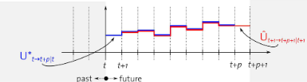
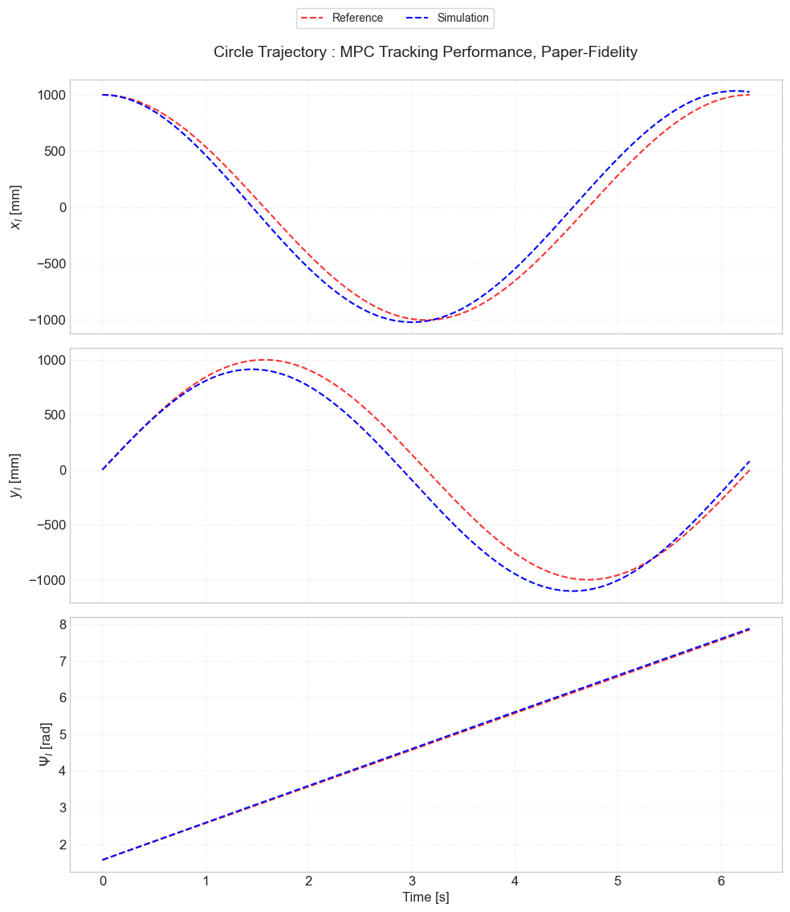
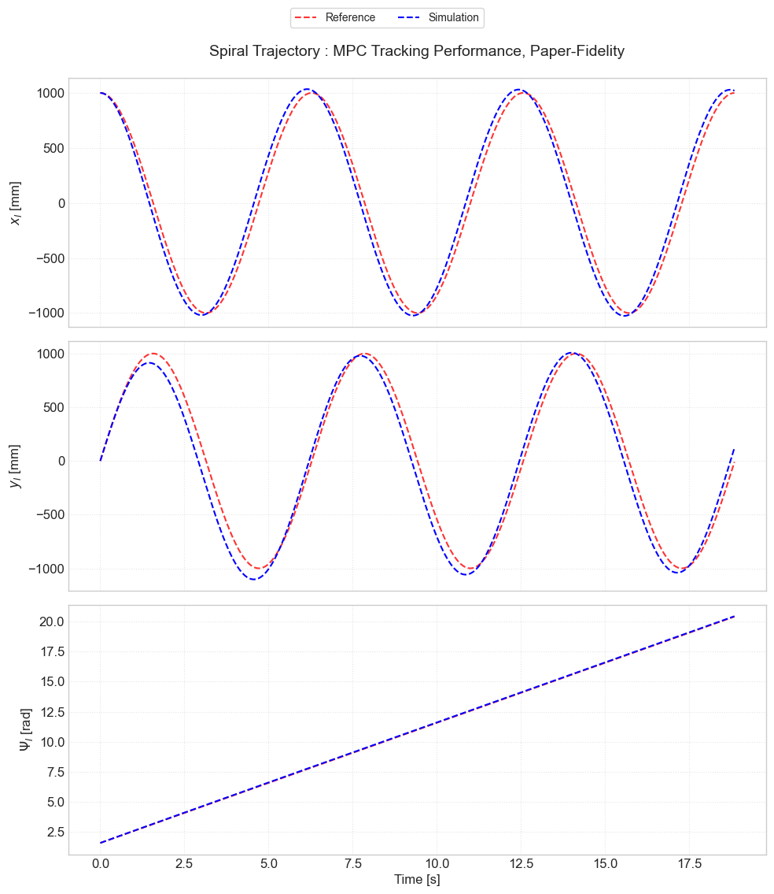
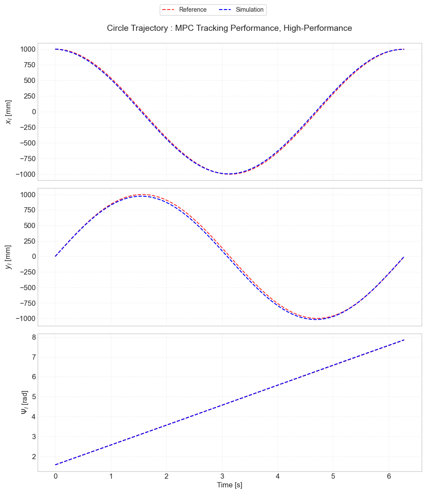
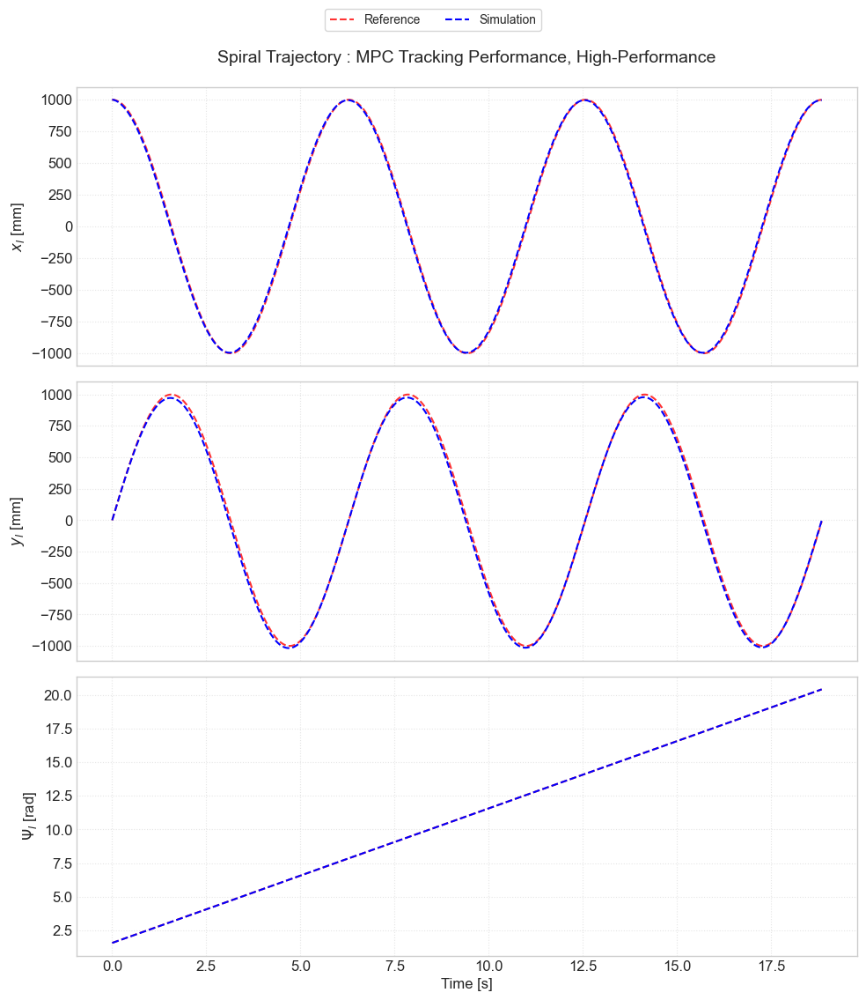
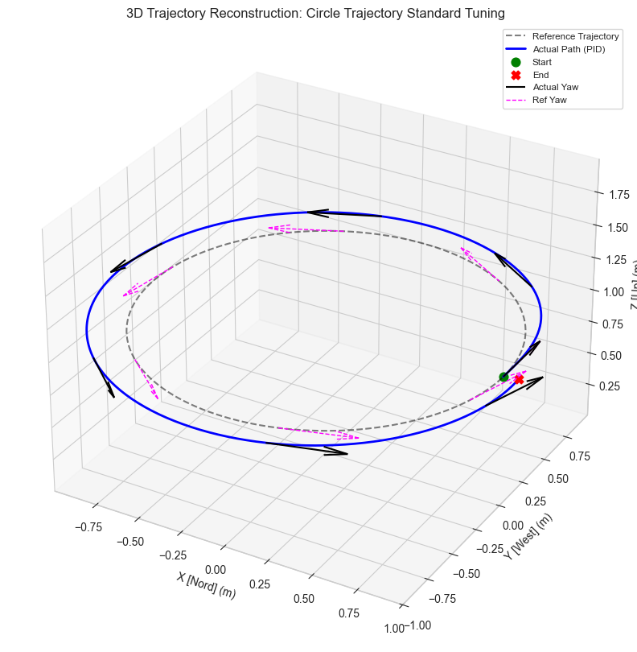
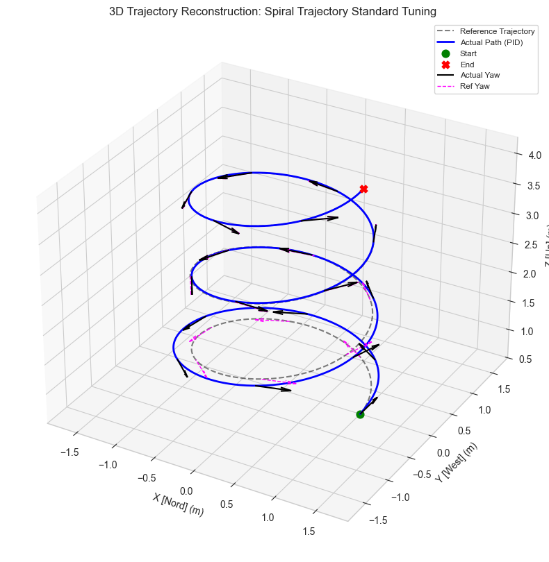
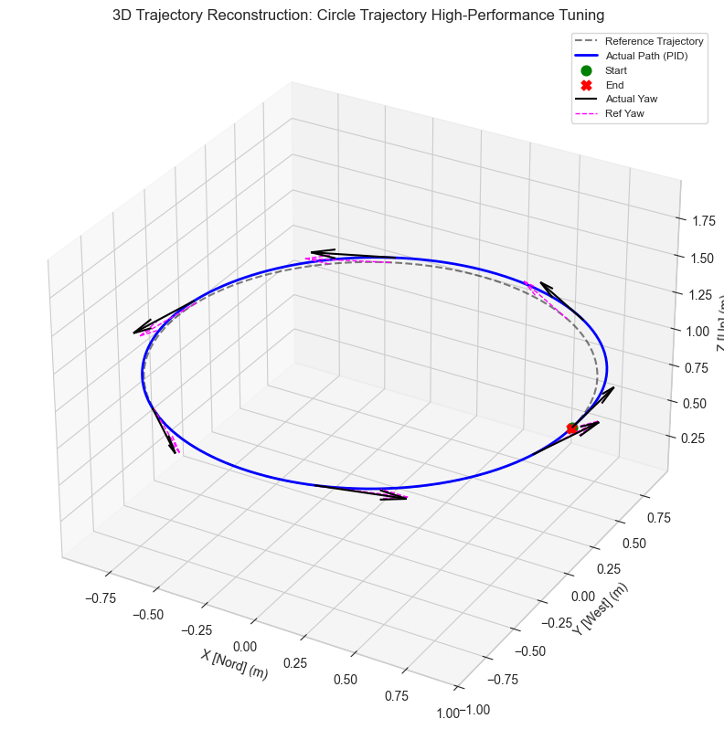
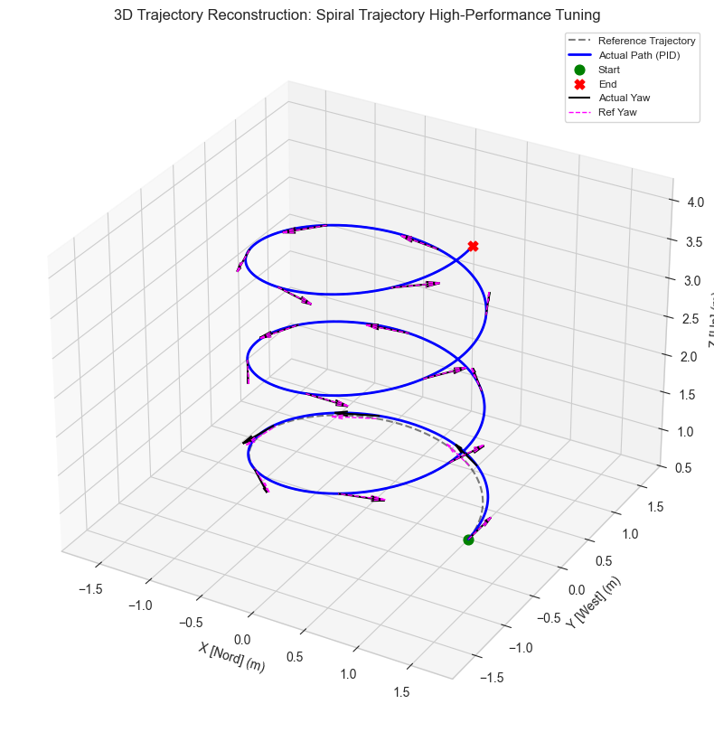

# Fast Model Predictive Control of Miniature Helicopters

This work presents a `MATLAB` based replication and extension of the control framework proposed by the authors for **Fast Model Predictive Control of Miniature Helicopters**. The original approach is reproduced with the objective of validating the reported results, while introducing improvements in the implementation and extending the analysis to additional scenarios. Trajectory generation is performed following the method proposed by Murray, ensuring dynamically feasible reference trajectories that respect the system constraints. The helicopter dynamics are modeled and discretized for real-time control, and a fast **Model Predictive Controller (MPC)** is implemented and evaluated. For comparison purposes, a classical **Proportional Integral Derivative (PID)** controller is also considered. Simulation results demonstrate that the replicated framework successfully reproduces the behavior described by the authors, while the proposed extensions improve tracking performance and robustness, confirming the effectiveness of fast MPC for aerial systems.

This project contains the material for the final exam project of the Modeling and Control of Cyber-Physical Systems II course for the academic year 2025-26. This course is offered by UniTS (Università degli Studi di Trieste), Trieste, Italy.


## Table of Contents

- [Introduction](#introduction)
- [Structure](#structure)
- [Tasks and goal setting](#tasks-and-goal-setting)
- [Usage](#usage)
- [Key Implementation Details](#key-implementation-details)
- [Results](#results)
    - [MPC Results](#MPC-Results)
    - [PID Results](#PID-Results)
    - [Overall Comparison](#Overall-Comparison)
- [Author](#author)
- [References](#references)


## Introduction

**Model Predictive Control (MPC)** control design for a miniature remote-controlled coaxial helicopter is developed and experimentally validated. The nonlinear dynamic behavior of the helicopter was identified, simplified and approximated by a *Linear Time Varying (LTV)* model. A custom convex optimization solver was generated for the specific MPC problem structure and integrated into a controller, which was tested in simulation and implemented using `MATLAB`. A performance analysis shows that the MPC approach performs better than a tuned **Proportional Integral Differential (PID)** controller.

## Structure

```bash
Fast_Model_Predictive_Control_of_Miniature_Helicopters/
│
├── config/                                     # Configuration and Parameters
│   ├── ControlParams.m                         # Control and algorithmic settings
│   ├── ModelParams.m                           # Model Parameters 
│   └── TrajectoryParams.m                      # Settings for reference paths 
│
├── models/                                     # Helicopter Model
│   ├── Discretization.m                        # Continuous to Discrete time conversion
│   ├── FlatnessMap.m                           # Differential Flatness (State <-> Flat Output)
│   └── HelicopterModel.m                       # Nonlinear model
│
├── notebooks/                                  # Jupyter Notebooks for Analysis (Python)
│   ├── MPC_Reconstruct_dynamics.ipynb          # Validation of MPC predictions
│   ├── MPC_Results_tracking.ipynb              # Analysis for MPC performance
│   └── PID_Reconstruct_dynamics.ipynb          # Validation of PID dynamics
│
├── plots/                                      # Visualization Outputs
│   ├── matlab/                                 # Figures generated by MATLAB
│   ├── python/                                 # Figures generated by Python notebooks
│   └── Helicopter_Blade_mCX2.png               # Reference system image
│
├── results/                                    # Results in csv
│   ├── MPC/
│   │   ├── High-Performance/                   # High-Performance setup
│   │   ├── Paper-Fidelity/                     # Replication of reference paper results
│   │   └── Terminal-Cost/                      # Terminal-Cost setup results
│   │
│   └── PID/
│       ├── High-Performance-Tuning/            # High-Performance PID results
│       └── Standard-Tuning/                    # Base PID results
│
├── scripts/                                    # Simulation Loops
│   ├── MPCSimulationLoop.m                     # Main loop for LTV-MPC simulation
│   └── PIDSimulationLoop.m                     # Main loop for PID benchmark simulation
│
├── src/                                        # Core Controller Source Code
│   ├── MPCController.m                         # LTV-MPC Logic and Optimization call
│   ├── PIDController.m                         # PID implementation
│   ├── QPBuilder.m                             # Sparse Matrix Construction for QP
│   └── TerminalCost.m                          # DLQR-based Terminal Cost calculation
│
├── tests/                                      # Unit Testing Suite
│   ├── DiscretizationTest.m
│   ├── FlatnessMapTest.m
│   ├── LTVLinearizationTest.m
│   ├── MPCControllerTest.m
│   ├── NonLinearModelTest.m
│   ├── PIDControllerTest.m
│   ├── QPBuilderTest.m
│   ├── TerminalCostTest.m
│   └── TrajectoryTest.m
│
├── trajectory/                                 # Reference Path Generators
│   ├── ShapeCircle.m
│   ├── ShapeHover.m
│   ├── ShapeSpiral.m
│   └── TrajectoryBase.m                        # Abstract base class for trajectories
│
├── Fast_Model_Predictive_Control_of_miniature_helicopters.pdf         # Main Project Documentation/Paper
├── LICENSE.txt                                 # License definition
├── main.m                                      # CLI Project Orchestrator (Entry Point)
├── README.md                                   # Project Overview
└── Report_Fast_Modell_Predictive_Control_of_Miniature_Helicopters.pdf # Project Report
```

## Tasks and goal setting

The primary task of this project is to design, implement, and validate a fast Linear Time-Varying Model Predictive Control (LTV-MPC) framework for trajectory tracking of a miniature helicopter. The main goal is to accurately follow dynamically feasible reference trajectories in real time while ensuring robustness, stability, and computational efficiency, and to benchmark the proposed solution against a classical PID controller.

## Usage

### Prerequisites

To successfully run the simulation and analysis pipelines, ensure your environment meets the following requirements:

#### MATLAB Environment
*   **Version:** MATLAB **R2024b** (or newer recommended).
*   **Required Toolboxes:**
    *   **Optimization Toolbox:** Required for `quadprog` (used to solve the sparse QP in the MPC controller).
    *   **Control System Toolbox:** Required for `dlqr`, `ss`, and `c2d` (used for Terminal Cost computation and Model Discretization).
*   **Core Solvers:**
    *   `ode45`: The project relies on this standard variable-step Runge-Kutta solver for the non-linear physics engine integration.

#### Python Environment (Analysis)
Used for post-processing logs and generating Jupyter Notebook visualizations.
*   **Python:** Version 3.8+
*   **Interface:** Jupyter Notebook or JupyterLab.
*   **Libraries:**
    *   `numpy` & `pandas` (Data manipulation)
    *   `matplotlib` (Visualization)
    *   `Pillow` (Animation export)
    *   `ipython` (Notebook display integration)


### Installation and Flow

1.  **Clone the repository**
    ```bash
    git clone https://github.com/tavaa/Fast_Model_Predictive_Control_of_Miniature_Helicopters.git
    cd Fast_Model_Predictive_Control_of_Miniature_Helicopters
    ```

2.  **Create and activate a virtual environment** (Recommended)
    
    *   **Linux / macOS:**
        ```bash
        python3 -m venv fast_mpc
        source fast_mpc/bin/activate
        ```
    *   **Windows:**
        ```bash
        python -m venv fast_mpc
        .\fast_mpc\Scripts\activate
        ```

3.  **Install dependencies**
    ```bash
    pip install -r requirements.txt
    ```

4.  **Launch the MATLAB EntryPoint**
    ```matlab
    main
    ```

5. **Select a Simulation or Test**

    Once the menu appears in the Command Window, follow the on-screen prompts:

    Enter **[1]** to run the full MPC Simulation Loop. This performs the trajectory generation, LTV linearization, and QP solving. Telemetry logs are automatically saved to `/results/MPC/`.

    Enter **[2]** to run the PID Benchmark Loop. This runs the classical control simulation for performance comparison. Logs are saved to `/results/PID/`.

    Enter **[3]** to access the Unit Test Suite. From here, you can validate specific subsystems (e.g., Physics, QP Construction, Terminal Cost) before running full simulations.

6. **Inspect Jupyter Notebooks and plots**

    Navigate to the `notebooks/` folder and open:

    `MPC_Results_tracking.ipynb`: To view 3D trajectory plots, tracking error (RMSE), and actuator usage (MPC).

    `PID_Results_tracking.ipynb`: To view 3D trajectory plots, tracking error (RMSE), and actuator usage (PID). 

    `MPC_Reconstruct_dynamics.ipynb`: To validate the accuracy of the LTV prediction model against the non-linear ground truth.

    Navigate to the `plots/` folder to simply visualize the plots.

    
## Key Implementation Details

This section summarizes the core architectural and algorithmic design choices of the proposed fast **Linear Time-Varying Model Predictive Control (LTV-MPC)** framework for miniature helicopters. The implementation follows the reference approach while introducing design refinements aimed at robustness, modularity, and real-time feasibility.

### Differential Flatness--Based Trajectory Generation

Reference trajectories are generated offline by exploiting the differential flatness property of the helicopter dynamics. The system is flat with respect to the inertial position and yaw angle, defined as $z = [x_I, y_I, z_I, \Psi]^T$.

Given smooth time profiles for the flat outputs and their derivatives up to second order, namely $z(t)$, $\dot{z}(t)$, and $\ddot{z}(t)$, the full reference state and input trajectories are reconstructed algebraically as $x_r(t) = h(z(t), \dot{z}(t))$ and $u_r(t) = i(z(t), \dot{z}(t), \ddot{z}(t))$.

This guarantees that all reference trajectories are dynamically feasible and consistent with the nonlinear system dynamics, eliminating the need for online trajectory optimization.

### Nonlinear Plant Model and Model Simplification

The helicopter is modeled as a *nonlinear rigid-body* system with translational dynamics expressed in the body frame and kinematic coupling through the yaw angle. The model includes linear drag terms, gravity-compensated vertical dynamics, and integral states for lateral position error rejection.

While the full nonlinear model is used for simulation and nominal trajectory propagation, the MPC prediction model intentionally omits selected cross-coupling terms, such as yaw--velocity and Coriolis effects. The resulting simplified prediction model can be written as $\dot{x} = f_{\text{simp}}(x,u)$ and improves robustness against model mismatch and noisy state estimates. This simplification can be disabled to recover full model fidelity.

### Linear Time-Varying MPC Formulation

At each sampling instant, the nonlinear dynamics are linearized around a time-varying nominal trajectory $(\hat{x}_k, \hat{u}_k)$, yielding the LTV system $x_{k+1} = A_k x_k + B_k u_k + d_k$.

The Jacobian matrices are defined as $A_k = \partial f / \partial x |_{\hat{x}_k,\hat{u}_k}$ and $B_k = \partial f / \partial u |_{\hat{x}_k,\hat{u}_k}$. The affine correction term is given by $d_k = f(\hat{x}_k,\hat{u}_k) - A_k \hat{x}_k - B_k \hat{u}_k$ and ensures consistency between the linear prediction model and the nonlinear plant.

### Warm-Start Strategy

To ensure real-time feasibility and solver convergence, a warm-start strategy is employed. The previously optimal control sequence is shifted forward in time according to $\hat{U}_{k+1} = [u^*_{k+1|k}, \ldots, u^*_{k+N-1|k}, u^*_{k+N-1|k}]$.

The corresponding nominal state trajectory is reconstructed by propagating the nonlinear dynamics, ensuring that the linearization remains close to the true system evolution and significantly reducing optimization time.



### Sparse Quadratic Programming Formulation

The finite-horizon MPC problem is cast as a sparse Quadratic Program (QP) of the form $\min_Z \tfrac{1}{2} Z^T H Z + f^T Z$, subject to $A_{\text{eq}} Z = b_{\text{eq}}$ and $Z_{\min} \le Z \le Z_{\max}$.

The decision vector is structured as $Z = [x_0^T, u_0^T, \ldots, u_{N-1}^T, x_N^T]^T$ to preserve the banded sparsity pattern of the dynamics constraints. The Hessian matrix $H$ is block-diagonal and contains the state, input, and terminal cost weighting matrices.

### Terminal Cost and Stability Considerations

To approximate the infinite-horizon optimal control problem and improve closed-loop stability, a quadratic terminal cost $\ell_f(x_N) = x_N^T Q_f x_N$ is included.

The terminal weight matrix $Q_f$ is obtained by solving the Discrete Algebraic Riccati Equation (DARE) associated with the linearized system. For hover, $Q_f$ is computed once around the equilibrium point, while for dynamic trajectories it is recomputed online around the terminal reference state.

Closed-loop stability is verified by checking that the spectral radius condition $\rho(A_d - B_d K) < 1$ is satisfied.

### Benchmark PID Controller

For comparison purposes, a classical PID controller is implemented using body-frame error coordinates. The control law is given by $u(k) = K_p e(k) + K_i \sum_{i=0}^{k} e(i) T_s + K_d (e(k)-e(k-1))/T_s + u_{\text{ff}}$, where $u_{\text{ff}}$ includes gravity feedforward compensation.

Integral anti-windup and actuator saturation are enforced to maintain closed-loop stability.

### Design Philosophy

The overall design prioritizes real-time feasibility, modularity, and faithful reproduction of the reference framework, while enabling controlled extensions toward robustness analysis, learning-based MPC, and embedded real-time deployment.


## Results

All figures and animations referenced in this section are located in `plots/python/` and are directly generated from the simulation logs. They illustrate spatial trajectories, temporal tracking behavior, and qualitative differences between control strategies.

### MPC Results

The LTV-MPC controller achieves accurate and stable trajectory tracking across all scenarios.  
In the **Paper-Fidelity** configuration, the controller exhibits smooth and conservative behavior, prioritizing robustness and low control effort at the cost of visible tracking lag, especially during curvilinear motion.




In the **High-Performance** configuration, increased state weighting and reduced input penalties significantly improve tracking accuracy. The helicopter closely follows both circular and spiral trajectories with minimal phase lag and negligible steady-state error.




Trajectory animations further highlight the predictive nature of MPC and its ability to anticipate future reference changes:

- `Trajectory_Animation_Circle_MPC_*.gif`
- `Trajectory_Animation_Spiral_MPC_*.gif`


### PID Results

The PID controller provides a baseline for comparison.  
With **Standard Tuning**, the controller struggles to compensate for centripetal forces during circular and spiral motion, resulting in large steady-state offsets and poor spatial fidelity.




Under **High-Performance Tuning**, tracking accuracy improves substantially; however, this comes at the cost of aggressive control actions and operation close to actuator saturation.




Animations (`Trajectory_Animation_*_PID_*.gif`) clearly show increased oscillations and less smooth motion compared to MPC, especially during spiral trajectories.


### Overall Comparison

Quantitative results confirm the qualitative observations.  
MPC consistently achieves lower tracking error with orders-of-magnitude less control effort compared to PID, while remaining computationally feasible in real time.

**Table 1 — MPC Performance Metrics**

| Scenario | State RMSE [m] | Input MSE | Avg. Solve Time [ms] |
|--------|----------------|-----------|----------------------|
| Hover (Paper-Fidelity) | ~0 | ~0 | 3.63 |
| Circle (Paper-Fidelity) | 0.1697 | 4.24e-3 | 3.52 |
| Spiral (Paper-Fidelity) | 0.1554 | 3.63e-3 | 3.39 |
| Circle (High-Perf.) | **0.0335** | 1.23e-3 | 4.12 |
| Spiral (High-Perf.) | **0.0316** | 5.0e-4 | 4.09 |

**Table 2 — PID Performance Metrics**

| Scenario | State RMSE [m] | Input MSE | Avg. Solve Time [ms] |
|--------|----------------|-----------|----------------------|
| Circle (Standard) | 0.1937 | 3.96e-2 | 0.005 |
| Spiral (Standard) | 0.1139 | 1.38e-2 | 0.006 |
| Circle (High-Perf.) | 0.0515 | **0.7445** | 0.006 |
| Spiral (High-Perf.) | 0.0336 | **0.8579** | 0.005 |

Overall, the LTV-MPC controller outperforms PID by leveraging prediction and model-based optimization: it achieves superior tracking accuracy with significantly lower control effort, while comfortably meeting real-time constraints at 50 Hz.


## Author

Matteo Tavano

* Email: matteo.tavano@studenti.units.it

> **Note:** This project was developed with the assistance of **Google Gemini 3.0** acting as an AI copilot, debugger and documentation tool. It represents a simplified replication of a complex aerospace engineering problem, specifically oriented towards adapting and benchmarking evolutionary algorithms for continuous domain optimization.

## References

1. Kiyak, Z. J., Hartfield, R. J., & Ledlow, T. W. (2014). Missile Trajectory Optimization Using a Modified Ant Colony Algorithm. Auburn University. https://www.semanticscholar.org/paper/Missile-trajectory-optimization-using-a-modified-Kiyak-Hartfield/4b52688ff709a352cb08fc3c28126953b58ea21b

2. Socha, K., & Dorigo, M. (2008). Ant colony optimization for continuous domains. European Journal of Operational Research. https://iridia.ulb.ac.be/~mdorigo/Published_papers/All_Dorigo_papers/SocDor2008ejor.pdf

3. RocketPy Team. RocketPy: A Six-Degree-of-Freedom Rocket Trajectory Simulator. https://github.com/RocketPy-Team/RocketPy


