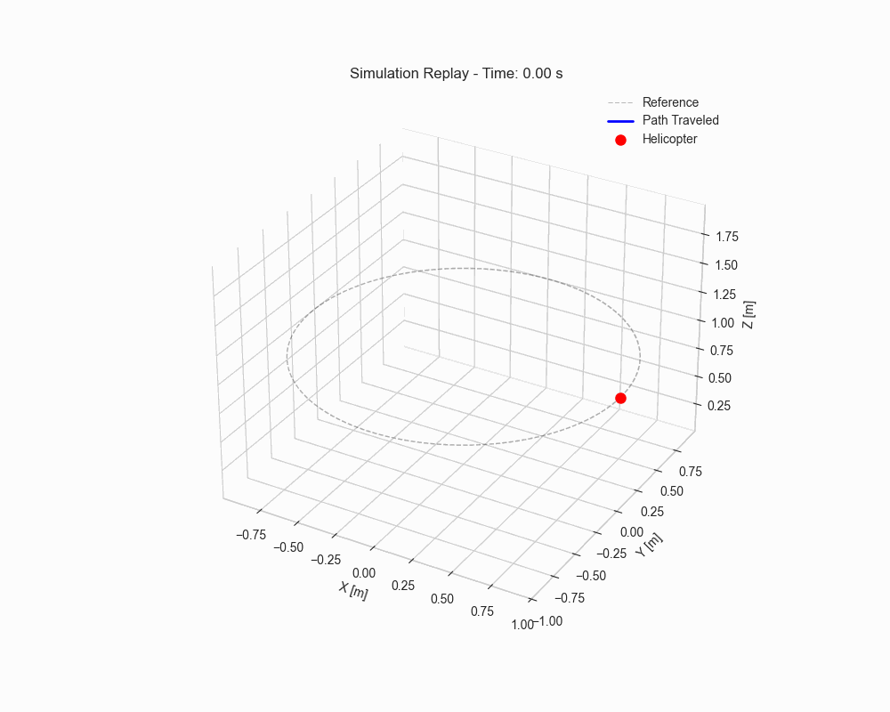
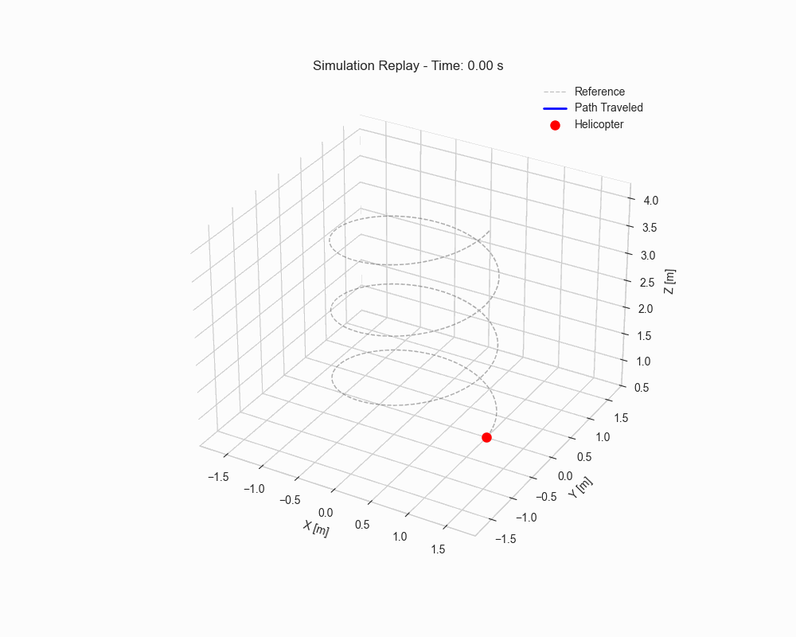

# Fast Model Predictive Control of Miniature Helicopters

<p align="center">
  <!-- Tech stack -->
  
  
</p>

<p align="center">
  <!-- GitHub stats -->
  
  
  
  <a href="mailto:matteo.tavano@studenti.units.it">
    
  </a>
</p>


This work presents a `MATLAB` based replication and extension of the control framework proposed by the authors for **Fast Model Predictive Control of Miniature Helicopters**. The original approach is reproduced with the objective of validating the reported results, while introducing improvements in the implementation and extending the analysis to additional scenarios. Trajectory generation is performed following the method proposed by Murray, ensuring dynamically feasible reference trajectories that respect the system constraints. The helicopter dynamics are modeled and discretized for real-time control, and a fast **Model Predictive Controller (MPC)** is implemented and evaluated. For comparison purposes, a classical **Proportional Integral Derivative (PID)** controller is also considered. Simulation results demonstrate that the replicated framework successfully reproduces the behavior described by the authors, while the proposed extensions improve tracking performance and robustness, confirming the effectiveness of fast MPC for aerial systems.

This project contains the material for the final exam project of the Modeling and Control of Cyber-Physical Systems II course for the academic year 2025-26. This course is offered by UniTS (Università degli Studi di Trieste), Trieste, Italy.

<br/>

<p align="center">
  
  
</p>

## Table of Contents

- [Introduction](#introduction)
- [Structure](#structure)
- [Tasks and goal setting](#tasks-and-goal-setting)
- [Usage](#usage)
- [Key Implementation Details](#key-implementation-details)
- [Results](#results)
    - [MPC Results](#MPC-Results)
    - [PID Results](#PID-Results)
    - [Overall Comparison](#Overall-Comparison)
- [Author](#author)
- [References](#references)


## Introduction

**Model Predictive Control (MPC)** control design for a miniature remote-controlled coaxial helicopter is developed and experimentally validated. The nonlinear dynamic behavior of the helicopter was identified, simplified and approximated by a *Linear Time Varying (LTV)* model. A custom convex optimization solver was generated for the specific MPC problem structure and integrated into a controller, which was tested in simulation and implemented using `MATLAB`. A performance analysis shows that the MPC approach performs better than a tuned **Proportional Integral Differential (PID)** controller.

## Structure

```bash
Fast_Model_Predictive_Control_of_Miniature_Helicopters/
│
├── config/                                     # Configuration and Parameters
│   ├── ControlParams.m                         # Control and algorithmic settings
│   ├── ModelParams.m                           # Model Parameters 
│   └── TrajectoryParams.m                      # Settings for reference paths 
│
├── models/                                     # Helicopter Model
│   ├── Discretization.m                        # Continuous to Discrete time conversion
│   ├── FlatnessMap.m                           # Differential Flatness (State <-> Flat Output)
│   └── HelicopterModel.m                       # Nonlinear model
│
├── plots/                                      # Visualization Outputs
│   ├── matlab/                                 # Figures generated by MATLAB
│   └── python/                                 # Figures generated by Python notebooks
│
├── results/                                    # Results in csv
│   ├── MPC/
│   │   ├── High-Performance/                   # High-Performance setup
│   │   ├── Paper-Fidelity/                     # Replication of reference paper results
│   │   ├── Terminal-Cost/                      # Terminal-Cost setup results
│   │   └── Ts-Analysis/                        # Ts and initial conditions results
│   │
│   └── PID/
│       ├── High-Performance-Tuning/            # High-Performance PID results
│       └── Standard-Tuning/                    # Base PID results
│
├── scripts/                                    # Simulation Loops
│   ├── MPCSimulationLoop.m                     # Main loop for LTV-MPC simulation
│   ├── MPCSimulationLoopv2.m                   # Main loop for LTV-MPC simulation with Ts Analysis
│   └── PIDSimulationLoop.m                     # Main loop for PID benchmark simulation
│
├── src/                                        # Core Controller Source Code
│   ├── MPCController.m                         # LTV-MPC Logic and Optimization call
│   ├── MPCControllerv2.m                       # LTV-MPC modified for Ts analysis
│   ├── PIDController.m                         # PID implementation
│   ├── QPBuilder.m                             # Sparse Matrix Construction for QP
│   └── TerminalCost.m                          # DLQR-based Terminal Cost calculation
│
├── tests/                                      # Unit Testing Suite
│   ├── DiscretizationTest.m
│   ├── FlatnessMapTest.m
│   ├── LTVLinearizationTest.m
│   ├── MPCControllerTest.m
│   ├── NonLinearModelTest.m
│   ├── PIDControllerTest.m
│   ├── QPBuilderTest.m
│   ├── TerminalCostTest.m
│   └── TrajectoryTest.m
│
├── trajectory/                                 # Reference Path Generators
│   ├── ShapeCircle.m
│   ├── ShapeHover.m
│   ├── ShapeSpiral.m
│   └── TrajectoryBase.m                        # Abstract base class for trajectories
│
├── Fast_Model_Predictive_Control_of_miniature_helicopters.pdf         # Main Project Documentation/Paper
├── LICENSE.txt                                 # License definition
├── main.m                                      # CLI Project Orchestrator (Entry Point)
├── README.md                                   # Project Overview
└── Report_Fast_Model_Predictive_Control_of_Miniature_Helicopters.pdf # Project Report
```

[Helicopter_plot](/plots/Helicopter_Blade_mCX2.png)

## Tasks and goal setting

The primary task of this project is to design, implement, and validate a fast Linear Time-Varying Model Predictive Control (LTV-MPC) framework for trajectory tracking of a miniature helicopter. The main goal is to accurately follow dynamically feasible reference trajectories in real time while ensuring robustness, stability, and computational efficiency, and to benchmark the proposed solution against a classical PID controller.


## Usage

### Prerequisites

To successfully run the simulation and analysis pipelines, ensure your environment meets the following requirements:

#### MATLAB Environment
*   **Version:** MATLAB **R2024b** (or newer recommended).
*   **Required Toolboxes:**
    *   **Optimization Toolbox:** Required for `quadprog` (used to solve the sparse QP in the MPC controller).
    *   **Control System Toolbox:** Required for `dlqr`, `ss`, and `c2d` (used for Terminal Cost computation and Model Discretization).
*   **Core Solvers:**
    *   `ode45`: The project relies on this standard variable-step Runge-Kutta solver for the non-linear physics engine integration.

### Installation and Flow

1.  **Clone the repository**
   
    ```bash
    git clone https://github.com/tavaa/Fast_Model_Predictive_Control_of_Miniature_Helicopters.git
    cd Fast_Model_Predictive_Control_of_Miniature_Helicopters
    ```

2.  **Launch the MATLAB EntryPoint: Open your MATLAB environment and run from console.**
   
    ```
    main
    ```

3. **Select a Simulation or Test**

    Once the menu appears in the MATLAB Command Window, follow the on-screen prompts by entering the corresponding number:

    *   **`[1]` MPC Simulation Loop**  
        Executes the full LTV-MPC pipeline: trajectory generation, linearization, and QP solving.  
        📂 *Logs are automatically saved to* `/results/MPC/`.

    *   **`[2]` PID Benchmark Loop**  
        Runs the classical PID control simulation for performance benchmarking.  
        📂 *Logs are saved to* `/results/PID/`.

    *   **`[3]` MPC Simulation Loop Ts**  
        Executes the MPC in depth analysis for Ts and different initial conditions.  
        📂 *Logs are automatically saved to* `/results/MPC/Ts-Analysis`.

    *   **`[4]` Unit Test Suite**  
        Launches the testing framework to validate specific subsystems (e.g., Physics Engine, QP Builder, Terminal Cost) before running full simulations.

4. **Inspect results and plots**

    Navigate to the `plots/` folder to simply visualize the plots, use instead `results/` to inspect the project results.

5. **Read the Report**

   For a complete explanation, read the pdf report `Report_Fast_Model_Predictive_Control_of_Miniature_Helicopters.pdf`. 

    
## Key Implementation Details

This project implements a **Linear Time-Varying Model Predictive Control (LTV-MPC)** framework designed for the control of miniature helicopters. Reference trajectories are generated offline using **Differential Flatness**, ensuring dynamic feasibility without the need for complex online optimization. The system utilizes a **nonlinear rigid-body model**, which is sequentially linearized along a time-varying nominal trajectory to maintain high prediction fidelity.

The optimal control problem is formulated as a **Sparse Quadratic Program (QP)**, preserving the banded structure of the dynamics constraints for efficient computation. To ensure real-time feasibility, a **Warm-Start strategy** propagates the previous optimal solution forward, significantly reducing solver convergence time. Closed-loop stability is enhanced via a **Terminal Cost ($Q_f$)**, computed by solving the Discrete Algebraic Riccati Equation (DARE) at the horizon's end. For performance comparison, a classical decoupled **PID controller** with gravity feedforward and integral anti-windup is included as a benchmark. The overall architecture prioritizes modularity and computational efficiency, bridging the gap between high-fidelity simulation and real-time constraints.


## Results

### MPC Results

The Model Predictive Control (MPC) strategy was evaluated under multiple configurations and flight scenarios (Hover, Circle, Spiral). Two main tuning strategies are reported below: **Paper-Fidelity** and **High-Performance**.


| Scenario | State MSE | State RMSE [m] | Input MSE | Avg. Solve Time [ms] |
|--------|-----------|----------------|-----------|----------------------|
| **MPC Paper-Fidelity** |||||
| Hover  | 7.79 × 10⁻²⁰ | 2.79 × 10⁻¹⁰ | 1.11 × 10⁻²⁰ | 4.28 |
| Circle | 0.0290 | 0.1703 | 4.16 × 10⁻³ | 3.87 |
| Spiral| 0.0243 | 0.1560 | 3.53 × 10⁻³ | 3.82 |
| **MPC High-Performance** |||||
| Hover  | 6.09 × 10⁻²⁰ | 2.47 × 10⁻¹⁰ | 3.97 × 10⁻²⁰ | 4.26 |
| Circle | 0.0011 | 0.0336 | 1.23 × 10⁻³ | 4.33 |
| Spiral| 0.0010 | 0.0316 | 0.51 × 10⁻³ | 4.13 |

**Key observations**
- MPC achieves **very low tracking error**, especially in dynamic trajectories.
- The **High-Performance configuration** significantly improves accuracy with minimal increase in computation time.
- Average solve time remains well below the 20 ms sampling period, confirming **real-time feasibility**.


### PID Results

The PID controller is used as a baseline for comparison and is evaluated under **Standard** and **High-Performance** tuning strategies.


| Scenario | State MSE | State RMSE [m] | Input MSE | Avg. Solve Time [ms] |
|--------|-----------|----------------|-----------|----------------------|
| **PID Standard Tuning** |||||
| Hover  | 0.0000 | 0.0000 | 0.0000 | 0.026 |
| Circle | 0.0375 | 0.1938 | 0.0396 | 0.006 |
| Spiral| 0.0130 | 0.1140 | 0.0139 | 0.007 |
| **PID High-Performance Tuning** |||||
| Hover  | 0.0000 | 0.0000 | 0.0000 | 0.053 |
| Circle | 0.0027 | 0.0515 | 0.7445 | 0.006 |
| Spiral| 0.0011 | 0.0337 | 0.8580 | 0.006 |

**Key observations**
- PID achieves acceptable tracking only with **aggressive tuning**.
- High tracking accuracy is obtained at the cost of **very high control effort**.
- Computational cost is negligible, but actuator saturation is frequently approached.

---

### Overall Comparison

The comparison highlights the fundamental trade-offs between predictive and reactive control strategies.

**Main conclusions**
- MPC consistently outperforms PID in **trajectory tracking accuracy**, especially for curvilinear motion.
- PID can reach similar accuracy only by applying **orders-of-magnitude higher control effort**, which is undesirable for real hardware.
- MPC leverages model prediction to anticipate future reference changes, resulting in smoother and more efficient control actions.

Overall, the results confirm the effectiveness of **fast LTV-MPC** for miniature helicopter control and its suitability for real-time applications.


## Author

Matteo Tavano

* Email: matteo.tavano@studenti.units.it

> **Note:** This project was developed with the assistance of **Google Gemini 3.0** acting as an AI copilot, debugger and documentation tool. 

## References

1. K. Kunz, S. M. Huck, T. H. Summers,  
   **Fast Model Predictive Control of Miniature Helicopters**,  
   *Proceedings of the 2013 European Control Conference (ECC)*, Zürich, Switzerland, 2013, pp. 1377–1382.  
   https://doi.org/10.23919/ECC.2013.6669699

2. R. M. Murray,  
   **Optimization-Based Control**,  
   California Institute of Technology, Chapter: *Trajectory Generation and Differential Flatness*, 2023.  
   http://www.cds.caltech.edu/~murray/books/AM08/pdf/obc-complete_12Mar2023.pdf

3. The MathWorks Inc.,  
   **MATLAB version: 24.2.0 (R2024b)**,  
   The MathWorks Inc., 2024.  
   https://www.mathworks.com

4. D. Q. Mayne, J. B. Rawlings, C. V. Rao, P. O. M. Scokaert,  
   **Constrained Model Predictive Control: Stability and Optimality**,  
   *Automatica*, vol. 36, no. 6, pp. 789–814, 2000.  
   https://doi.org/10.1016/S0005-1098(99)00214-9

5. H. Chen, F. Allgöwer,  
   **A Quasi-Infinite Horizon Nonlinear Model Predictive Control Scheme with Guaranteed Stability**,  
   *Automatica*, vol. 34, no. 10, pp. 1205–1217, 1998.  
   https://doi.org/10.1016/S0005-1098(98)00067-1


